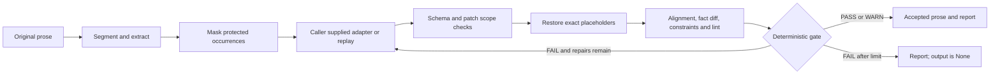

# Verification Core architecture

Publication note: the development checks below describe the pre-publication state. See the root README for current prerelease downloads.

The main product is the Japanese writing Skill, with the natural-prose workflow
in `references/astra-writing.md`. This document describes its optional lexical
verification engine, not a naturalness evaluator or automatic model selector.

The LLM proposes edits; deterministic code checks a declared lexical subset.
The unchanged four-mode/six-genre Skill remains useful without Python.
The optional Python engine is standard-library-only, with no network or provider dependency.

## Data and boundaries

`DocumentState` contains original and normalized source, lossless sentence chunks,
protected occurrences, current chunks, report, and redacted attempt history.
Extraction and comparison are pure functions. The pipeline returns new state
objects; the caller-provided adapter is its only external-effect boundary.
No process-global state, user-text cache or automatic recording is used.

`core/normalize.py` performs NFKC for numeric and glossary matching, using original
offset mappings and exact Decimal tuples. It does not rewrite source text.
Numeric normalization equates formatting such as fullwidth digits, grouping,
decimal trailing zeros and supported Japanese integers. This does not preserve
significant-figure notation as a separate constraint. Unit case and magnitude
remain significant; automatic unit conversion is intentionally absent.
Code, equations and URLs are preserved exactly, without compatibility normalization.

`core/segment.py` preserves every character and offset. Japanese punctuation,
newlines and delimited Western endings form chunks. Markdown is not a full AST;
explicit code, math and URL spans receive basic protection from splitting.
`core/align.py` matches unique exact chunks, then uses monotone dynamic programming
with 1:1, 1:2 and 2:1 matches. Low similarity produces a warning. This supports
simple sentence splits, joins and exact reordering, not arbitrary semantic alignment.

Fact comparison uses multisets within aligned chunks: occurrence counts matter.
Same-kind unmatched items are paired as `fact.changed`; otherwise they are
`fact.removed` or `fact.added`. Pairing is explanatory, not proof that two claims
have the same referent. A matching inventory does not prove the absence of a
semantic error within a chunk.

Reports use PASS/WARN/FAIL. Hard failures include protected-item differences,
empty replacement prose and explicit constraint failures. The ten lint rules
are advisory and never implement rewrites. No LLM-generated score affects a gate.

## Adapter and repair contract

`Adapter.propose(request)` returns `{"edits": [{"sentence_id": 0, "text": "..."}]}`.
`CallableAdapter` wraps a caller-supplied provider function; `ReplayAdapter` consumes
an explicit in-memory list. No vendor SDK integration or live-provider compatibility
has been tested in this candidate. Providers must preserve instruction/data
separation themselves; malicious text is not removed from source documents.

Every patch must use an allowed stable original chunk ID. Unknown keys, duplicate
IDs, invalid types and changes outside repair scope fail closed. Input/output
schemas are shipped as JSON Schema 2020-12; the stdlib validator implements only
the keywords used by those schemas and rejects unsupported keywords.
The first proposal may edit any chunk. At most two repairs target finding IDs;
document-wide constraints can involve all IDs. Each repair receives the immutable
masked original of relevant chunks, rather than treating invented values in a
failed candidate as trusted. Existing unaffected candidate chunks remain unchanged.
All proposals also receive `document_context`: the entire masked original in
source order, including chunks that are not editable on repair. It stays under
the untrusted-data boundary and does not expand `allowed_sentence_ids`. A model
may return empty edits to keep contextually appropriate wording; WARN-only output
then stops without another repair. Hard failures still withhold output.

Masking requires exact token multiplicity, order and chunk location. It protects
literal values, not semantic assignment. This is defense in depth against prompt
injection, not a complete prompt-injection prevention claim. Empty output and
protected-fact damage are mechanically blocked; semantic manipulation is not.

## Formats and size

Text and offsets use Unicode code points. Files are UTF-8, optional BOM on input.
The configuration loader accepts JSON or a documented flat YAML subset: top-level
scalar keys and indented scalar lists, without nested mappings, tags, anchors,
inline comments, multiline values or implicit object construction. Unknown keys fail.
Settings are read only from explicit `--config` / `--glossary` paths.

Document comparison is limited to 50,000 code points and 500 sentence chunks.
Similarity and diff computations can be expensive on repetitive input. These
limits are engineering bounds, not a latency or complexity guarantee.
The CLI never overwrites files, never interprets model text as a path, and requires
an explicit new destination for any saved report or accepted replay prose.

## Compatibility and release state

The root `SKILL.md`, name, invocation metadata, four modes and six genre references
remain in their established locations. The root was not moved under a new `skill/`
directory because existing Git and ZIP installation paths rely on it.
The new `references/verification.md` is loaded only for optional verification.
The candidate version is `2.0.0rc2`; the installed original and public release have
not been replaced. See [evaluation.md](evaluation.md) for actual evidence and
[scope.md](scope.md) for the accepted feature boundaries.
